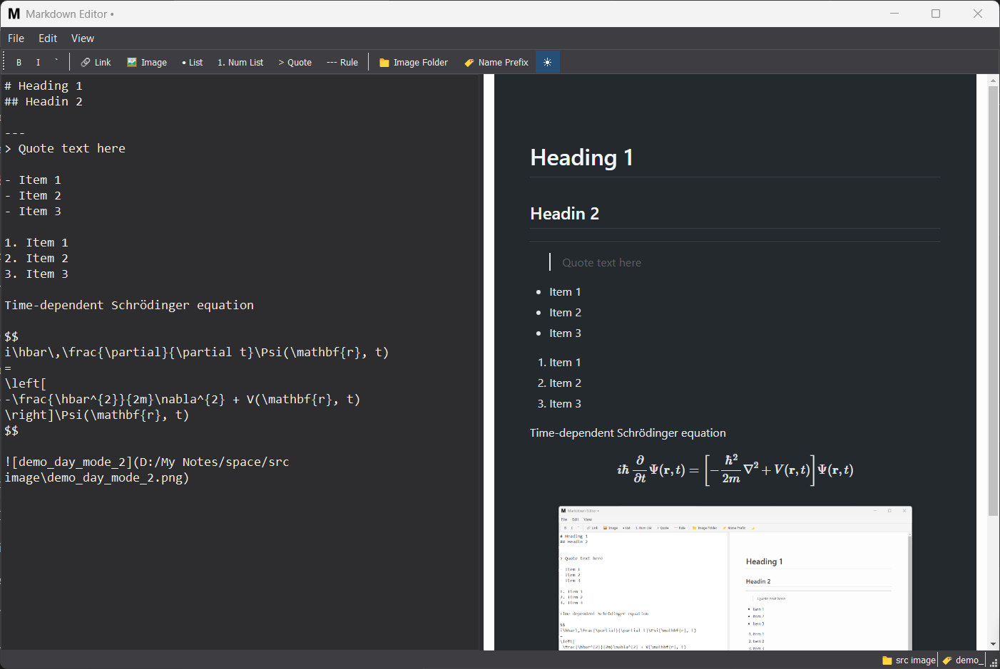
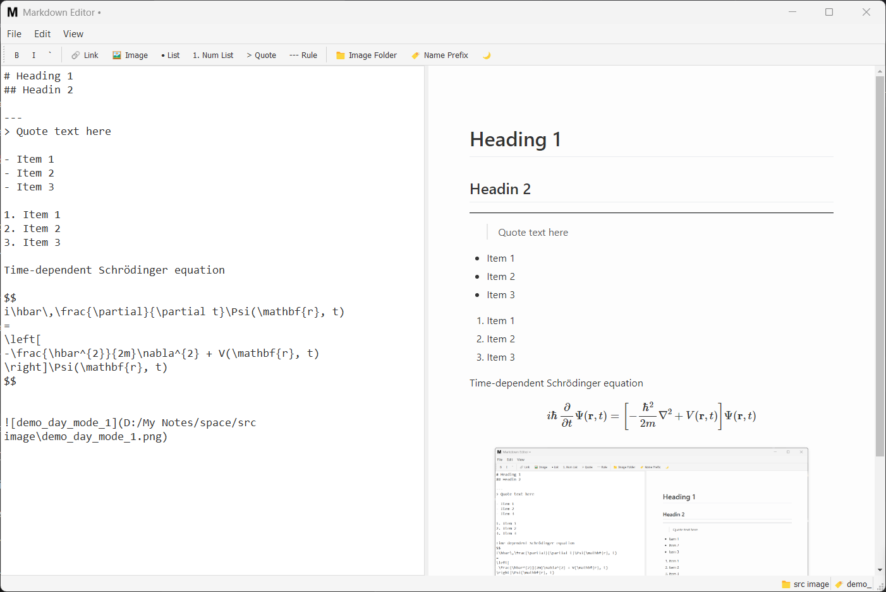

# 📝 Markdown Editor







A feature-rich, dual-pane Markdown editor with live preview, theme support, and seamless image handling. Built with PyQt5 for a native desktop experience.

## ✨ Features

- **Dual-pane interface**: Write Markdown on the left, see live HTML preview on the right
- **Dark/Light Mode**: Toggle between themes with a single click
- **Image Management**:
  - Paste images directly from clipboard
  - Customizable save locations and filename prefixes
  - Automatic relative path handling
- **Toolbar Shortcuts**: Quick access to common Markdown formatting
- **Responsive Preview**: Auto-updates with a smart debounce timer
- **Persistent Settings**: Remembers your preferences between sessions
- **Cross-platform**: Works on Windows, macOS, and Linux

## 🛠️ Requirements

- Python 3.7+
- PyQt5
- pypandoc (recommended) or python-markdown
- PyQtWebEngine (for enhanced preview)

## 📦 Installation

### Option 1: Using pip (recommended)

```bash
# Clone the repository
git clone https://github.com/AbhayaKumarKanhar/py-markedit/tree/main
cd markdown-editor

# Create and activate virtual environment (optional but recommended)
python -m venv venv
source venv/bin/activate  # Linux/MacOS
# OR
venv\Scripts\activate    # Windows

# Install dependencies
pip install -r requirements.txt
```

### Option 2: Manual installation

```bash
pip install PyQt5 pypandoc markdown
# For enhanced preview (recommended):
pip install PyQtWebEngine
```

## 🚀 Usage

```bash
python markdown_editor/main.py
```

### Keyboard Shortcuts

| Shortcut          | Action                     |
|-------------------|----------------------------|
| `Ctrl+N`          | New document               |
| `Ctrl+O`          | Open file                  |
| `Ctrl+S`          | Save file                  |
| `Ctrl+Shift+S`    | Save as                    |
| `Ctrl+B`          | Bold text                  |
| `Ctrl+I`          | Italic text                |
| `F5`              | Refresh preview            |
| `Esc`             | Toggle night mode          |

## ⚙️ Configuration

The application automatically saves and restores these settings:

- Window position and size
- Splitter position between editor and preview
- Theme preference (dark/light mode)
- Default image save folder
- Image filename prefix

To reset all settings, delete the configuration file located at:
- **Windows**: `%APPDATA%\MyApp\Markdown Editor`
- **macOS**: `~/Library/Preferences/MyApp/Markdown Editor`
- **Linux**: `~/.config/MyApp/Markdown Editor`

## 🧩 Architecture

The application follows a modular design:

```
markdown_editor/
├── main.py               # Application entry point
├── editor/               # Editor components
│   ├── markdown_text_edit.py  # Custom editor with image handling
│   └── preview_handler.py     # Preview rendering
├── handlers/             # File and image operations
│   ├── file_handler.py   # Open/save/drag-drop functionality
│   └── image_handler.py  # Image saving and path management
├── ui/                   # User interface components
│   ├── toolbar.py        # Formatting toolbar
│   ├── menu.py           # Menu bar setup
│   └── statusbar.py      # Status bar with settings display
├── theme/                # Theme management
│   └── theme_manager.py  # Light/dark theme implementation
├── converter/            # Markdown conversion
│   └── markdown_converter.py  # HTML conversion with themes
└── utils.py              # Helper functions
```

## 🤝 Contributing

Contributions are welcome! Please follow these steps:

1. Fork the repository
2. Create a new feature branch (`git checkout -b feature/your-feature`)
3. Commit your changes (`git commit -am 'Add some feature'`)
4. Push to the branch (`git push origin feature/your-feature`)
5. Create a new Pull Request

## 📜 License

This project is licensed under the MIT License - see the [LICENSE](LICENSE) file for details.


## 🙏 Acknowledgements

- [Python](https://www.python.org/) - Programming language
- [PyQt5](https://www.riverbankcomputing.com/software/pyqt/) - GUI framework
- [pandoc](https://pandoc.org/) - Document conversion backend
- [Python Markdown](https://python-markdown.github.io/) - Fallback Markdown processor
